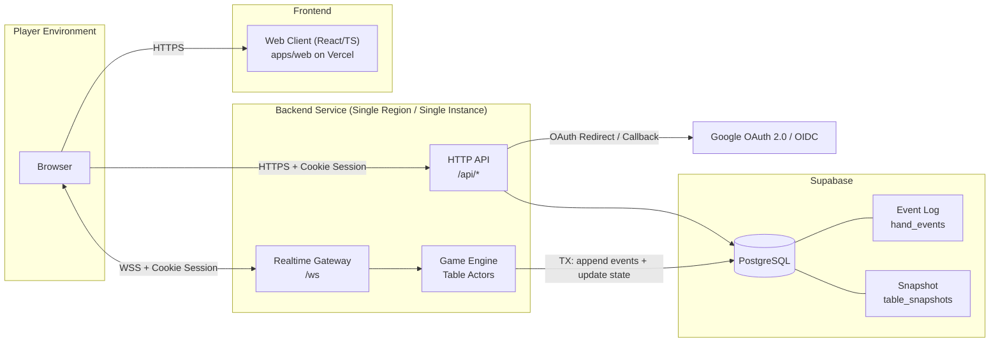
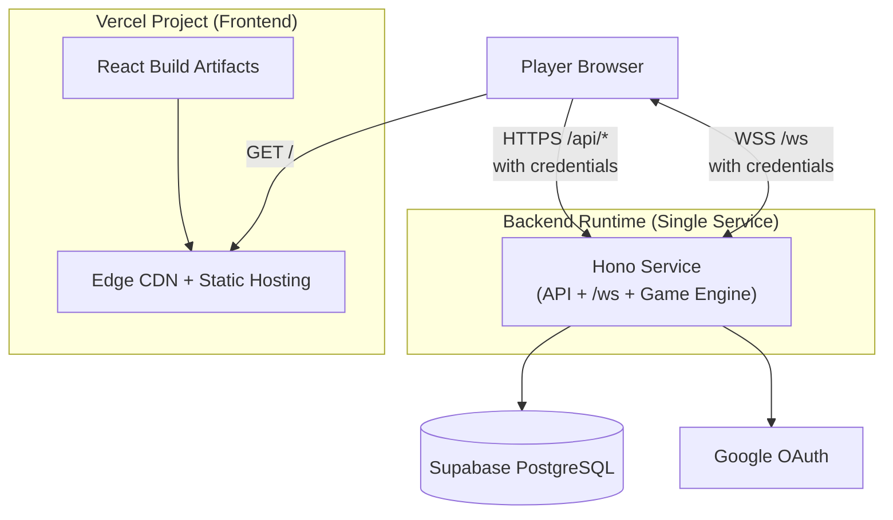
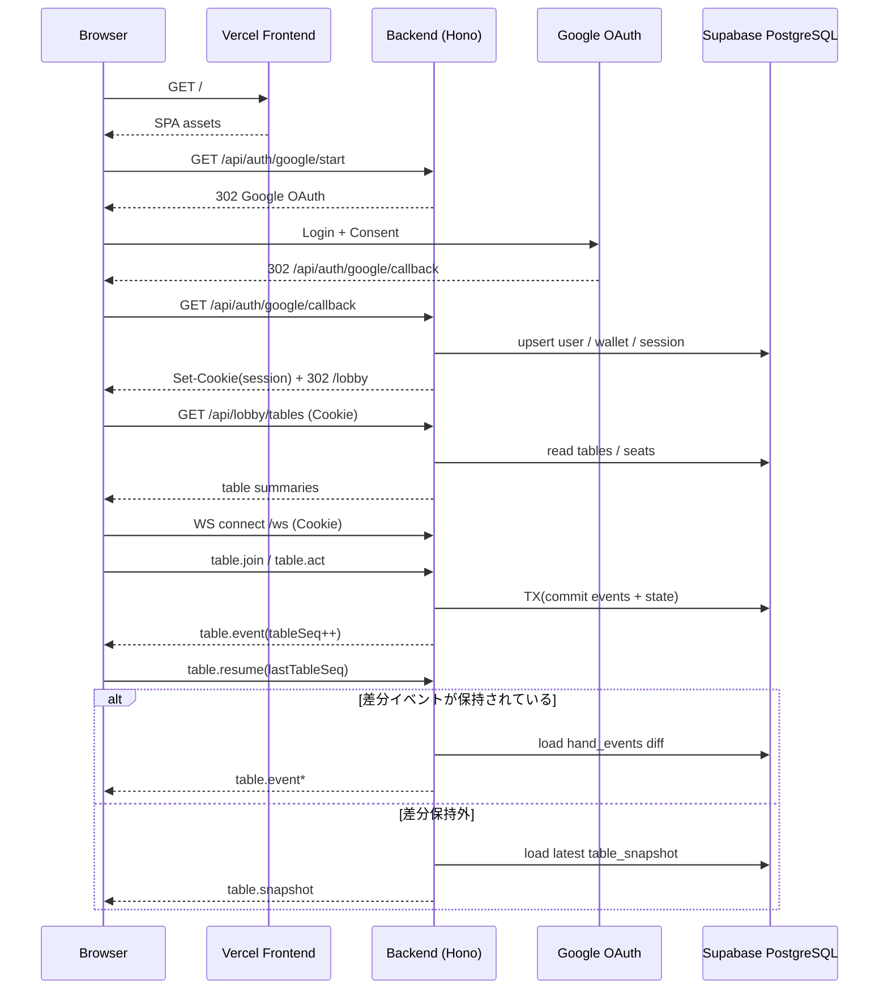

# Mix Stud Online 全体アーキテクチャ図（MVP）

Version: v1.0  
Last Updated: 2026-02-11  
参照要件: [`要件定義書_mvp.md`](./要件定義書_mvp.md)  
参照設計: [`詳細設計書_mvp.md`](./詳細設計書_mvp.md)  
契約仕様: [`openapi.yaml`](./openapi.yaml), [`asyncapi.yaml`](./asyncapi.yaml)  
DDL: [`20260211190000_create_tables.sql`](../../supabase/migrations/20260211190000_create_tables.sql)  

---

## 1. 本書の目的

- `docs/mvp` 配下の要件・設計・契約仕様を統合し、MVP全体の構成を1枚で把握できるようにする。
- フロントエンドを **Vercel** 配置としたときのデプロイ構成を明示する。
- 実装前に、通信経路・責務境界・復旧経路の認識を揃える。

---

## 2. 構成サマリ

| レイヤ | 構成要素 | 役割 |
| --- | --- | --- |
| Frontend | `apps/web`（React + TypeScript + Vite） on Vercel | 画面表示、HTTP呼び出し、WebSocket接続管理 |
| Backend | `apps/server`（Hono + TypeScript）単一サービス | API / Realtime Gateway / Game Engine（Table Actor） |
| Data | Supabase (PostgreSQL) | ユーザー、席、ハンド、イベントログ、スナップショット永続化 |
| Auth | Google OAuth 2.0 / OIDC | ログインとID連携 |

制約（MVP）:

- 単一リージョン、単一ゲームサーバー構成（2卓固定）。
- サーバー権威モデル（クライアントは表示と入力のみ）。
- `hand_events` を正史とし、再接続・再起動時はイベント再生で整合を回復。

---

## 3. 全体構成図（論理）



---

## 4. デプロイ構成図（Vercel Frontend）



実装上の要点:

- Cookieセッション（`HttpOnly`）をHTTP/WSの両方で利用する。
- `with credentials` 前提のため、CORS/Origin制御を本番ドメインに合わせて固定する。
- ローリング更新は「新規ハンド開始停止 -> 進行中ハンド終了待ち -> デプロイ」を運用標準とする。

---

## 5. 主要シーケンス（認証 -> プレイ -> 復元）



---

## 6. 品質観点（運用チェック）

- 整合性: 「DBコミット成功後のみ配信」を厳守し、配信先行を禁止する。
- 復旧性: 再起動時は `hands.status=IN_PROGRESS` のイベントリプレイで復元する。
- 順序性: クライアントは `tableSeq` 欠番を検知したら `table.resume` を送る。
- 可観測性: 認証/接続/アクション/エラー/復元ログと主要メトリクスを継続監視する。

---

## 7. 実行基盤選定記録（MVP）

選定結果:

- Frontend: **Vercel**
- Backend Runtime: **Cloud Run**
- Database: **Supabase PostgreSQL**

### 7.1 選定理由（Cloud Run）

1. MVPが「単一サービス」「単一リージョン」「2卓固定」であり、Cloud Runの運用モデルと一致する。
2. API/WS/Game Engine同居のコンテナをそのまま載せやすく、実装変更を最小化できる。
3. フルマネージドでデプロイ・運用負荷を抑えられ、MVPの検証速度を確保できる。
4. Supabase PostgreSQLと疎結合に構成でき、DB設計（DDL/OpenAPI/AsyncAPI）を維持できる。

### 7.2 Cloud Run採用時の注意点

- Cloud RunのWebSocket接続はリクエストタイムアウト上限（最大60分）の制約を受ける。
- 長時間プレイは「同一接続の維持」ではなく「切断 -> 再接続 -> `table.resume` 差分同期」で継続する前提とする。
- 同一インスタンスへの再接続は保証されないため、サーバーメモリ依存ではなくDB永続化状態を正とする。
- コールドスタート影響を抑えるため、`min-instances=1` を基本設定とする。

### 7.3 運用ルール（MVP）

1. クライアントはWebSocket切断時に自動再接続し、接続直後に `table.resume(lastTableSeq)` を必ず送信する。
2. サーバーは `hand_events` 差分返却を優先し、保持範囲外は `table.snapshot` を返す。
3. 監視で「接続断回数」「resume成功率」「snapshotフォールバック率」を継続監視する。

## 8. 本番ドメイン方針（`app.*` / `api.*` 分離）

ドメイン方針:

- Frontend: `https://app.example.com`（Vercel）
- Backend API/WS: `https://api.example.com` / `wss://api.example.com`（Cloud Run）
- Cookieは `api.example.com` 発行のHost-onlyで運用する（`Domain` 属性は付与しない）。

### 8.1 CORS設定値（固定値）

適用対象:

- HTTP API（`/api/*`）
- WebSocket handshake（`/ws`）の `Origin` 検証

許可設定:

- `Access-Control-Allow-Origin`:
  - `https://app.example.com`（prod）
  - `https://stg-app.example.com`（stg）
  - `http://localhost:5173`（local）
- `Access-Control-Allow-Credentials`: `true`
- `Access-Control-Allow-Methods`: `GET,POST,PUT,PATCH,DELETE,OPTIONS`
- `Access-Control-Allow-Headers`: `Content-Type, X-Requested-With`
- `Access-Control-Max-Age`: `600`

禁止事項:

- `Access-Control-Allow-Origin: *` を使用しない（credentials付き通信と両立不可）。
- 許可Originのワイルドカード運用をしない（明示列挙のみ）。

### 8.2 Cookie設定コード例（Hono / TypeScript）

```ts
import { setCookie } from "hono/cookie";

setCookie(c, "__Host-session", sessionId, {
  httpOnly: true,
  secure: true,
  sameSite: "Lax",
  path: "/",
  maxAge: 60 * 60 * 24 * 7, // 7 days
});
```

補足:

- `__Host-` プレフィックス要件により `path=/` かつ `Domain` なしを強制できる。
- フロントエンドのHTTP/WSは credentials付きで接続する（`fetch(..., { credentials: "include" })`）。

### 8.3 OAuth Redirect URI 一覧（Google OAuth設定）

Authorized redirect URIs:

1. `http://localhost:3000/api/auth/google/callback`（local backend）
2. `https://stg-api.example.com/api/auth/google/callback`（stg backend）
3. `https://api.example.com/api/auth/google/callback`（prod backend）

運用ルール:

- Google Cloud ConsoleのOAuth Client設定は上記URIと完全一致で登録する。
- redirect先は常に `api.*` 側コールバックに統一し、成功後に `app.*` へ `302` で返す。

## 9. 監視基盤方針（MVP）

採用（GCPデフォルト）:

- ログ集約: Cloud Logging
- メトリクス可視化/アラート: Cloud Monitoring
- 例外集約: Error Reporting
- 外形監視: Uptime Check（`GET /api/health`）

### 9.1 最小監視セット（初期導入）

1. Uptime Check失敗アラート
2. HTTP 5xx率アラート
3. p95レイテンシアラート
4. Error Reporting新規エラー通知

### 9.2 初期アラート閾値（推奨）

1. Uptime Check
条件: 5分内に2回以上失敗、重要度: Critical
2. 5xx率
Warning: 5分平均 > 1%、Critical: 2分平均 > 5%
3. p95レイテンシ（HTTP）
Warning: 10分平均 > 800ms、Critical: 5分平均 > 1200ms
4. 再接続品質（ログベースメトリクス）
Warning: `table.snapshot` フォールバック率が15分平均 > 5%、Critical: `table.resume` 失敗率が15分平均 > 2%

### 9.3 通知先（MVP）

- Email（必須）
- Slack または Discord Webhook（任意）

運用補足:

- Cloud RunのWebSocket接続上限（最大60分）を前提に、再接続品質メトリクスを必須監視とする。
- 監視はまずGCP標準機能のみで開始し、必要時に外部SaaS（例: Sentry）を追加する。
