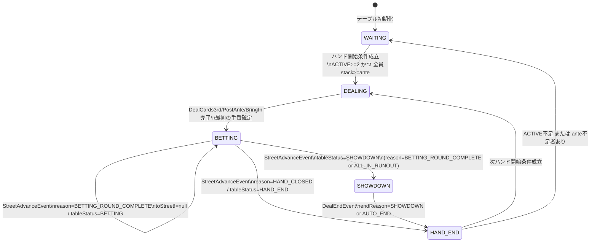
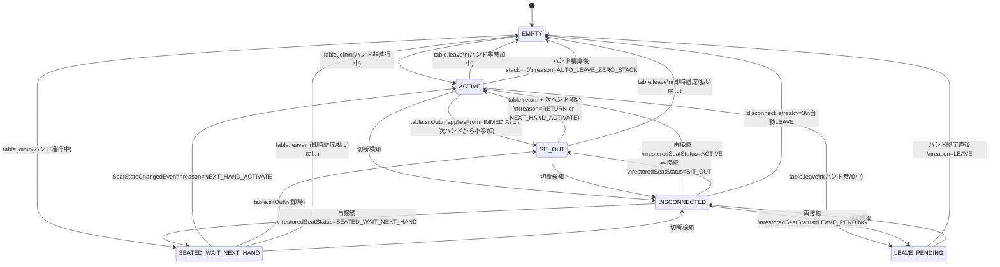
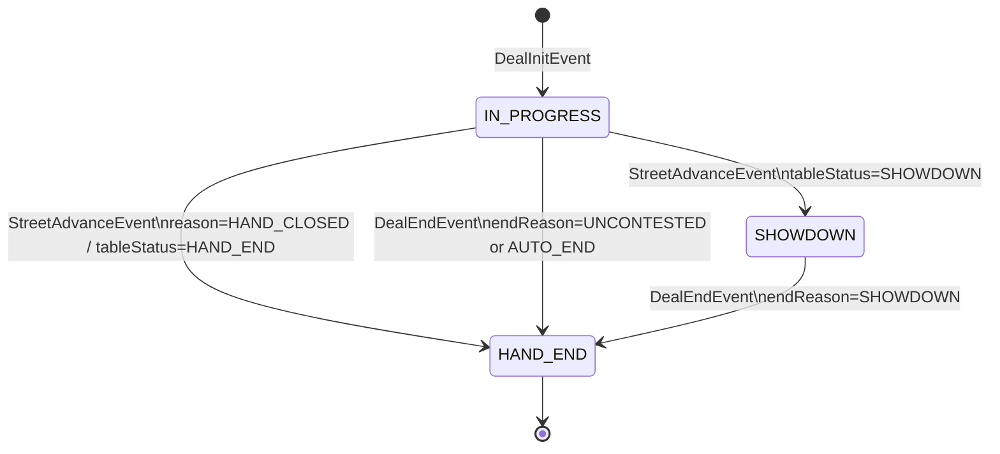
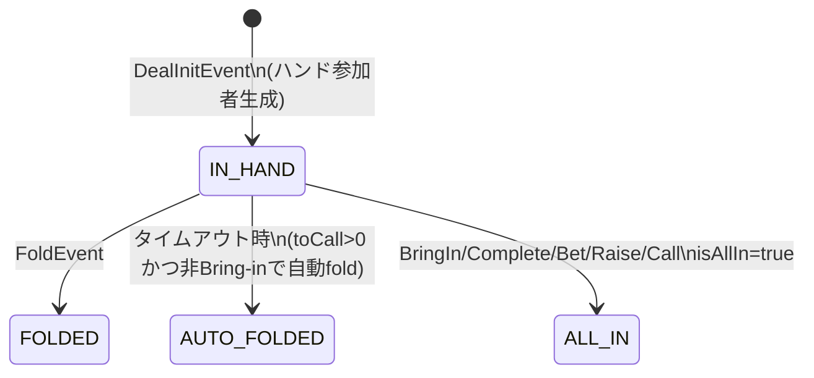

# Mix Stud Online 状態遷移図（MVP）

Version: v1.0  
Last Updated: 2026-02-10  
参照要件: [`要件定義書_mvp.md`](./要件定義書_mvp.md)  
参照設計: [`詳細設計書_mvp.md`](./詳細設計書_mvp.md)  
契約仕様: [`openapi.yaml`](./openapi.yaml), [`asyncapi.yaml`](./asyncapi.yaml)  
DDL: [`20260211190000_create_tables.sql`](../../supabase/migrations/20260211190000_create_tables.sql)  

---

## 1. 本書の位置づけ

- 本書は `docs/mvp` 配下の仕様から状態遷移を図式化した補助資料です。
- enum定義は `openapi.yaml` / `asyncapi.yaml` / `supabase/migrations/20260211190000_create_tables.sql` を正とします。
- 遷移条件は `詳細設計書_mvp.md` の `4.2`, `5.1`, `5.5`, `5.6`, `7.3.1`, `10.2`, `10.3` を基準に整理しています。

---

## 2. テーブル状態遷移 (`tables.status`)

---

## 3. 席状態遷移 (`table_seats.status`)

補足:

- `SeatStateChangedEvent.appliesFrom` は `IMMEDIATE` / `NEXT_HAND` の2値で、同一遷移でも適用タイミングが異なる場合があります。
- `PlayerDisconnectedEvent` は `seatStatus=DISCONNECTED` を通知し、`PlayerReconnectedEvent` は `restoredSeatStatus` へ復帰します。

---

## 4. ハンド状態遷移 (`hands.status`)

---

## 5. ハンド内プレイヤー状態遷移 (`hand_players.state`)

補足:

- `FOLDED`, `AUTO_FOLDED`, `ALL_IN` は同一ハンド内の終端状態です。
- `IN_HAND` は終局まで維持される場合があります（チェック/コール継続など）。

---

## 6. 実装時チェックポイント

- テーブル遷移とハンド遷移の整合:
  - `tables.status=SHOWDOWN` のとき `hands.status=SHOWDOWN` へ遷移済みであること
  - `DealEndEvent` 処理後に双方 `HAND_END` へ揃うこと
- 席遷移とハンド参加可否の整合:
  - `SEATED_WAIT_NEXT_HAND` / `SIT_OUT` / `DISCONNECTED` は新規ハンド不参加であること
  - `LEAVE_PENDING` はハンド終了直後に必ず `EMPTY` へ収束すること
- 切断復帰の整合:
  - `disconnect_streak` は再接続時に0へリセット
  - 3ハンド連続切断時に `EMPTY`（自動LEAVE）へ到達すること
- イベント永続化の参照整合:
  - `hand_events.table_id -> tables.id` と `hand_events(hand_id, table_id) -> hands(id, table_id)` のFK制約により、復元/差分配信の前提となるイベント整合がDB層で担保されること
