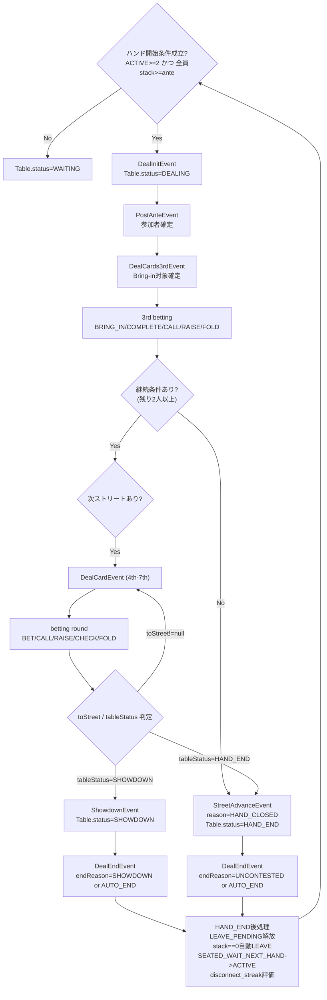

# Mix Stud Online 画面設計書（MVP）

Version: v1.0  
Last Updated: 2026-02-10  
参照要件: [`要件定義書_mvp.md`](./要件定義書_mvp.md)  
参照設計: [`詳細設計書_mvp.md`](./詳細設計書_mvp.md)  
状態遷移補助: [`状態遷移図_mvp.md`](./状態遷移図_mvp.md)  
契約仕様: [`openapi.yaml`](./openapi.yaml), [`asyncapi.yaml`](./asyncapi.yaml)  
DDL: [`001_create_tables.sql`](./ddl/001_create_tables.sql)  

---

## 1. 本書の目的

- 画面実装時に必要な「状態」と「表示/操作」の対応を明確化する。
- 特に複雑な席状態遷移（`EMPTY -> SEATED_WAIT_NEXT_HAND -> ACTIVE -> SIT_OUT -> DISCONNECTED -> LEAVE_PENDING`）を、イベント・コマンド単位で誤解なく扱えるようにする。
- 列挙済み状態を、実際の遷移条件とフローとして可視化する。

---

## 2. 画面一覧（MVP）

| 画面ID | 画面名   | 主目的                                   | 主データソース                  |
| ------ | -------- | ---------------------------------------- | ------------------------------- |
| SCR-01 | ログイン | Google OAuthで認証しセッションを確立     | `GET /api/auth/*`              |
| SCR-02 | ロビー   | 卓一覧確認と参加導線                     | `GET /api/lobby/tables`        |
| SCR-03 | テーブル | 着席/離席、ハンド進行表示、アクション入力 | `WebSocket table.*`, `table.*` |
| SCR-04 | 履歴     | ハンド履歴一覧/詳細確認                  | `GET /api/history/hands*`      |

以降は、状態遷移の中心となる `SCR-03 テーブル` を詳細化する。

---

## 3. 状態遷移図の参照方針

- 状態遷移図の正本は [`状態遷移図_mvp.md`](./状態遷移図_mvp.md) とする。
- 本書では重複定義を避けるため、図の再掲は行わず「画面実装時の解釈・表示制御」に集中する。
- 参照先:
  - テーブル状態遷移: [`状態遷移図_mvp.md`](./状態遷移図_mvp.md) の「2. テーブル状態遷移」
  - 席状態遷移: [`状態遷移図_mvp.md`](./状態遷移図_mvp.md) の「3. 席状態遷移」
  - ハンド内プレイヤー状態遷移: [`状態遷移図_mvp.md`](./状態遷移図_mvp.md) の「5. ハンド内プレイヤー状態遷移」

---

## 4. ハンド進行フロー図（テーブル画面）

ハンド内プレイヤー状態（`hand_players.state`）の更新ポイント:

| 条件                                              | 遷移                         | 主イベント/契機                     |
| ------------------------------------------------- | ---------------------------- | ----------------------------------- |
| 通常参加開始                                      | `IN_HAND`                    | `DealInitEvent`                     |
| プレイヤーが `fold` を選択                        | `IN_HAND -> FOLDED`          | `FoldEvent`                         |
| タイムアウト時に `toCall>0`（非Bring-in）で自動Fold | `IN_HAND -> AUTO_FOLDED`     | 内部 `AutoActionCommand` -> `FoldEvent` |
| 賭け金投入時に `isAllIn=true`（不足分全額投入含む） | `IN_HAND -> ALL_IN`          | `BringIn/Complete/Bet/Raise/Call`   |
| `check/call` などで継続可能                       | `IN_HAND` 維持               | 各アクションイベント                 |

---

## 5. テーブル画面の表示制御（実装用）

| 対象               | 表示/操作ルール |
| ------------------ | --------------- |
| 自席が `SEATED_WAIT_NEXT_HAND` | 観戦UIを表示し、アクションボタンは無効化。`SIT OUT`/`LEAVE` のみ許可。 |
| 自席が `ACTIVE` かつ手番       | `table.act` 入力を有効化。タイマー表示を強調。 |
| 自席が `ACTIVE` かつ非手番     | アクションボタン無効、進行イベントのみ反映。 |
| 自席が `SIT_OUT`               | 次ハンド不参加バッジ表示。`table.return`/`table.leave` を表示。 |
| 自席が `LEAVE_PENDING`         | 退席予約表示。再着席操作を拒否（UIでも抑止）。 |
| 自席が `DISCONNECTED`          | 再接続中オーバーレイ表示。復帰後は `restoredSeatStatus` に従いUI再構成。 |

---

## 6. 実装チェック観点

- `SeatStateChangedEvent.reason` と `appliesFrom` をUIログ表示に保持し、遷移理由の追跡を可能にする。
- `table.status` と `hands.status` の不整合（例: `HAND_END` なのに手番UIが有効）を監視ログで検知する。
- `LEAVE_PENDING` と `DISCONNECTED` の組み合わせ時は、ハンド終了で必ず `EMPTY` に収束することを結合テストで担保する。
