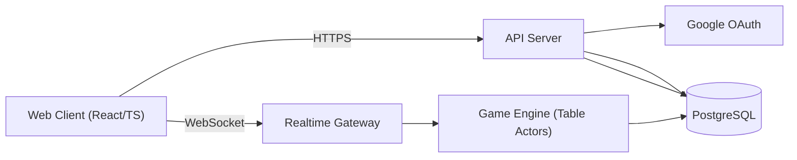
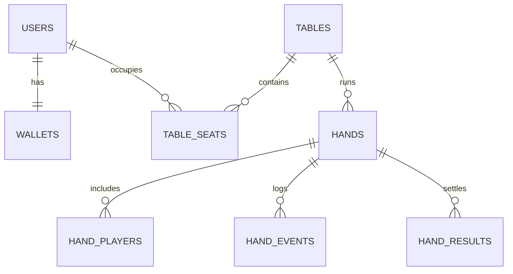

# Mix Stud Online 詳細設計書（MVP）

Version: v1.0  
Last Updated: 2026-02-11  
参照要件: `docs/mvp/要件定義書_mvp.md`  
全体構成図: [`全体アーキテクチャ図_mvp.md`](./全体アーキテクチャ図_mvp.md)
APIリファレンス閲覧: [`APIリファレンス閲覧ガイド_mvp.md`](./APIリファレンス閲覧ガイド_mvp.md)
実装推進ガイド: [`実装推進ガイド_mvp.md`](./実装推進ガイド_mvp.md)  
進捗管理シート: [`進捗管理シート_mvp.md`](./進捗管理シート_mvp.md)

---

## 1. 本書の目的

本書は、MVPとして以下3ゲームをリアルタイム対戦可能にするための詳細設計を定義する。

- Stud Hi
- Razz
- Stud Hi-Lo（Stud8）

対象は「実装可能な粒度」の仕様確定であり、画面/API/イベント/DB/進行ロジック/復旧/テスト方針までを含む。

---

## 2. 設計原則

- サーバー権威モデルを徹底し、クライアントは表示と入力のみを担当する。
- 1卓を1つの直列処理コンテキスト（Table Actor）で処理し、競合と順序崩れを防止する。
- ゲーム進行はイベントログにより永続化し、再起動後も復元可能にする。
- ゲーム固有ルールはプラガブルな `GameRule` 実装へ分離し、将来のHORSE拡張に備える。
- MVPは2卓固定のため、分散システムを過剰導入せず、単一リージョン・単一ゲームサーバー構成を基本とする。

---

## 3. システム構成

## 3.1 論理構成



Vercel配置を前提にしたデプロイ視点の全体図は [`全体アーキテクチャ図_mvp.md`](./全体アーキテクチャ図_mvp.md) を参照。

## 3.2 コンポーネント責務

| コンポーネント   | 主責務                                                     |
| ---------------- | ---------------------------------------------------------- |
| Web Client       | ログイン、ロビー表示、卓表示、履歴表示、WebSocket接続管理  |
| API Server       | 認証、セッション発行、ロビー取得、履歴取得                 |
| Realtime Gateway | 接続管理、認可、コマンド受信、イベント配信                 |
| Game Engine      | ルール判定、進行、タイムアウト処理、イベント生成           |
| PostgreSQL       | ユーザー、卓、席、ハンド、イベントログ、結果、監査ログ保存 |

## 3.3 技術選定（MVP）

| 領域     | 採用                                                     |
| -------- | -------------------------------------------------------- |
| Frontend | React + TypeScript + Vite                                |
| Backend  | Hono + TypeScript（API/Gateway/Game Engine同一プロセス） |
| Realtime | WebSocket（JSONメッセージ）                              |
| DB       | Supabase (PostgreSQL)                                    |
| Auth     | Google OAuth 2.0 / OIDC                                  |

## 3.4 デプロイ前提（MVP）

- アプリケーション: API/Gateway/Game Engineを同一サービスとして1インスタンスで稼働
- FrontendはVercel、Backend実行基盤はCloud Runを採用する
- DB: Supabase（マネージドPostgreSQL）を利用
- 固定卓: 運営作成済み2卓を初期データとして投入
- ローリング更新時は「新規手開始を一時停止 -> 進行中ハンド終了待ち -> デプロイ」を標準運用とする
- Cloud RunのWebSocket接続上限（最大60分）を前提に、切断時は再接続後 `table.resume` で差分同期して継続する
- コールドスタート抑制のため `min-instances=1` を基本設定とする

補足（選定理由・注意点）:

- 実行基盤選定の根拠と運用ルールは [`全体アーキテクチャ図_mvp.md`](./全体アーキテクチャ図_mvp.md) の「7. 実行基盤選定記録（MVP）」を参照。

## 3.5 DBマイグレーション方針

- マイグレーションは **Supabase CLI** (`supabase migration`) を使用する
- マイグレーションファイルは生SQL形式で `supabase/migrations/` 配下に配置する
- ローカル開発環境は `supabase start`（Docker）でSupabase互換のPostgreSQLを起動する
- ローカル運用時は `pnpm db:start` / `pnpm db:start:api` / `pnpm db:reset` / `pnpm db:status` / `pnpm db:stop` を使用する
- Colima 利用時の `pnpm db:start` は失敗時に、まず `edge-runtime/logflare/vector` 除外のAPI利用可能構成へ、さらに失敗した場合は DB 最小構成へフォールバックして起動する
- 認証/REST（`SERVICE_ROLE_KEY` 取得や `/rest/v1/*` 検証）を行う場合は `pnpm db:start:api` または full起動を使用する
- 本番適用は `supabase db push` でリモートプロジェクトへ反映する
- DDLの正本は `supabase/migrations/` とし、重複コピーを作らない
- seed投入・ローカル起動・DBリセットの実行手順と期待値は `supabase/migrations/README.md` を正とする

M1-01時点の初期migration一覧:

| 種別 | Supabase migration |
| --- | --- |
| テーブル作成 | `supabase/migrations/20260211190000_create_tables.sql` |
| インデックス作成 | `supabase/migrations/20260211190100_create_indexes.sql` |
| 初期データ投入 | `supabase/migrations/20260211190200_seed_initial_data.sql` |

---

## 4. ドメイン設計

## 4.1 主要エンティティ

| エンティティ | 説明                                                 |
| ------------ | ---------------------------------------------------- |
| User         | プレイヤー。Googleアカウントと紐付く                 |
| Wallet       | プレイマネー残高                                     |
| Table        | 卓設定（ステークス固定、人数上限、現在のゲーム種別） |
| Seat         | 卓内の座席と着席状態                                 |
| Hand         | 1回の配札〜精算までの単位                            |
| HandPlayer   | ハンド参加プレイヤーのスナップショット               |
| Pot          | メイン/サイドポットの論理表現                        |
| Event        | 進行ログ（正史）                                     |

## 4.2 状態モデル

### テーブル状態

- `WAITING`: アクティブ参加者が2未満
- `DEALING`: 配札中
- `BETTING`: アクション待ち
- `SHOWDOWN`: 手札公開と判定
- `HAND_END`: 配当確定・次ハンド準備

### 席状態

- `EMPTY`
- `SEATED_WAIT_NEXT_HAND`（途中参加・次ハンド待ち）
- `ACTIVE`
- `SIT_OUT`
- `DISCONNECTED`
- `LEAVE_PENDING`（ハンド終了待ち離席）

### ハンド内プレイヤー状態

- `IN_HAND`
- `FOLDED`
- `ALL_IN`
- `AUTO_FOLDED`（タイムアウト等）

状態遷移の図解は以下を参照:

- [`画面設計書_mvp.md`](./画面設計書_mvp.md)
- [`状態遷移図_mvp.md`](./状態遷移図_mvp.md)

## 4.3 共通識別子

- `user_id`: UUID
- `table_id`: UUID
- `hand_id`: UUID
- `event_id`: UUID
- `table_seq`: 卓内通番（1,2,3...）
- `hand_seq`: ハンド内通番（1,2,3...）

## 4.4 チップ/バイインモデル

- `wallet.balance`: 卓外ウォレット残高
- `seat.stack`: 卓内スタック
- 着席時は `wallet -> seat` へ `buyIn` を移動
- 退席時は `seat -> wallet` へ残額を払い戻し

バイイン制約:

- `buyIn <= 2000`（要件）
- `buyIn >= 400`（本設計の暫定値）
- `buyIn <= wallet.balance`
- ハンド進行中のリバイ/追加入金は不可（MVP）

---

## 5. テーブル進行詳細

## 5.1 ハンド開始条件

- 次を満たすと新ハンド開始:
  - `Seat.status in (ACTIVE)` の人数が2人以上
  - 上記プレイヤー全員が `stack >= ante`
- `SIT_OUT`、`SEATED_WAIT_NEXT_HAND` は不参加

## 5.2 ディーラーポジション

- Studでも公平性のため `dealer_seat` をハンドごとに1席時計回りで進める。
- 配札順、同点時オッドチップ配分起点に使用する。

## 5.3 ミックスローテーション

- ローテーション順: `StudHi -> Razz -> Stud8 -> repeat`
- 6ハンドごとに次ゲームへ移行
- `table.mix_index` で現在ゲーム、`table.hands_since_rotation` で手数を管理

更新ルール:

1. ハンド終了時に `hands_since_rotation += 1`
2. `hands_since_rotation == 6` なら `mix_index = (mix_index + 1) % 3`、`hands_since_rotation = 0`

## 5.4 ストリート進行

| Street | 配布        | ベット単位     |
| ------ | ----------- | -------------- |
| 3rd    | Hole2 + Up1 | Small Bet($20) |
| 4th    | Up1         | Small Bet($20) |
| 5th    | Up1         | Big Bet($40)   |
| 6th    | Up1         | Big Bet($40)   |
| 7th    | Hole1       | Big Bet($40)   |

## 5.5 途中参加（ハンド進行中着席）

- ハンド進行中の `table.join` 成功時は `SEATED_WAIT_NEXT_HAND` とする。
- 進行中ハンドには参加せず、次ハンド開始時に `ACTIVE` へ遷移する。
- 待機中クライアントへは観戦情報（公開情報のみ）を配信する。

待機中の状態遷移:

- `SEATED_WAIT_NEXT_HAND` 中に `SIT_OUT` 要求 → 即時 `SIT_OUT` へ遷移
- `SEATED_WAIT_NEXT_HAND` 中に `LEAVE` 要求 → 即時席解放、チップは `wallet` へ払い戻し

## 5.6 スタック0時の扱い

- ハンド精算後 `seat.stack == 0` のプレイヤーは自動 `LEAVE`。
- 自動LEAVE時は席を解放し、ロビー人数へ即時反映する。
- 補充不可のため、同卓再参加にはウォレット残高の範囲で再バイインが必要。

---

## 6. ルールエンジン設計

## 6.1 ルール抽象

```ts
interface GameRule {
  gameType: "STUD_HI" | "RAZZ" | "STUD_8";
  determineBringIn(players: BringInCandidate[]): SeatId;
  determineFirstToAct(street: Street, players: StreetView[]): SeatId;
  evaluateShowdown(players: ShowdownHand[]): ShowdownResult;
}
```

## 6.2 Bring-in判定

### StudHi / Stud8

比較優先順位（要件準拠）:

1. ペア判定: ペア無しがBring-in対象
2. Upcardランク: 低いランクがBring-in対象（A高）
3. スート: `Spade > Heart > Diamond > Club`（強い順）

実装上は「弱さスコア」が最も高いプレイヤーを選ぶ。

### Razz

比較優先順位（要件準拠）:

1. ペア判定: ペア有りがBring-in対象
2. Upcardランク: 高いランクがBring-in対象（A低）
3. スート: `Club > Diamond > Heart > Spade`（強い順）

## 6.3 アクション合法性

### 共通

- 非手番プレイヤーのアクションは拒否。
- `FOLDED`/`ALL_IN` プレイヤーのアクションは拒否。
- 1Streetあたり上限 `5bet`（1bet + 4raise）。
- ヘッズアップを含め全卓で同一キャップを適用。

### 3rd Street（Bring-in局面）

- Bring-in対象者に `bring_in` を強制。
- 次手番以降の選択肢:
  - `fold`
  - `call`（現在不足分）
  - `complete`（$20まで引き上げ）
  - `raise`（complete後のみ）

### 4th以降

- 選択肢:
  - `check`（toCall=0）
  - `bet`（未ベット時）
  - `call`
  - `raise`
  - `fold`
- 4th Streetでの「オープンペア時にBig Bet可能」ルールは採用しない（要件のStreet固定額を優先）。

## 6.4 All-in/サイドポット

- 不足時は保有スタック全額を投入して `ALL_IN`。
- ベット額不足が発生しても手は継続。
- 精算時は各プレイヤー拠出合計からポット分割を再構築。

ポット再構築手順:

1. 参加プレイヤーごとの総拠出額を昇順ソート
2. 最小拠出差分ごとにポット層を作る
3. 各層の勝者集合へ配当

## 6.5 ショーダウン

### 公開順

- 最終ストリートで最後に攻撃的アクション（bet/raise）したプレイヤーから開始。
- 以降時計回り。
- 全員checkで終わった場合は最初にアクションしたプレイヤーから。

### 自動マック

- 既公開の勝ちハンドに負け確定なら自動マック。
- 勝ちうる/同点可能性ありならショー強制。

### Stud8分割

- Hi/Loを別評価し、Lo資格は `8以下5枚`。
- Lo資格者無しならHi総取り。
- スクープは同一プレイヤーに両配当。
- オッドチップは先にHi側へ割当。
- サイドポットがある場合も各ポット単位でHi/Lo評価を独立して実施する。

## 6.6 デッキ/シャッフル

- 52枚標準デッキ、ジョーカー無し。
- ハンド開始時に毎回初期化し `Fisher-Yates` でシャッフル。
- 乱数源は `crypto` のCSPRNGを使用し、疑似乱数ライブラリを使用しない。
- デッキ順はサーバー内メモリのみ保持し、クライアント送信禁止。
- 監査用に `deck_hash`（平文不可逆ハッシュ）を `hands` に保存する。

---

## 7. リアルタイム通信設計

## 7.1 メッセージ共通フォーマット

```json
{
  "type": "table.command",
  "requestId": "uuid",
  "tableId": "uuid",
  "sentAt": "2026-02-08T12:00:00.000Z",
  "payload": {}
}
```

サーバーイベント:

```json
{
  "type": "table.event",
  "tableId": "uuid",
  "tableSeq": 128,
  "handId": "uuid",
  "handSeq": 44,
  "occurredAt": "2026-02-08T12:00:01.120Z",
  "eventName": "RaiseEvent",
  "payload": {}
}
```

## 7.2 クライアント -> サーバーコマンド

| type           | payload                   | 説明             |
| -------------- | ------------------------- | ---------------- |
| `table.join`   | `tableId`, `buyIn`        | 着席要求         |
| `table.sitOut` | `tableId`                 | SIT OUT          |
| `table.return` | `tableId`                 | SIT OUT解除      |
| `table.leave`  | `tableId`                 | LEAVE            |
| `table.act`    | `action`, `amount?`       | ゲームアクション |
| `table.resume` | `tableId`, `lastTableSeq` | 再接続復元       |
| `ping`         | -                         | 生存確認         |

## 7.3 サーバー -> クライアントイベント

| eventName                 | 用途               |
| ------------------------- | ------------------ |
| `DealInitEvent`           | ハンド初期化       |
| `DealCards3rdEvent`       | 3rd配札            |
| `DealCardEvent`           | 4th〜7th配札       |
| `PostAnteEvent`           | Ante徴収           |
| `BringInEvent`            | Bring-in処理       |
| `CompleteEvent`           | Complete           |
| `BetEvent`                | Bet                |
| `RaiseEvent`              | Raise              |
| `CallEvent`               | Call               |
| `CheckEvent`              | Check              |
| `FoldEvent`               | Fold               |
| `StreetAdvanceEvent`      | Street遷移         |
| `ShowdownEvent`           | 公開進行           |
| `DealEndEvent`            | ハンド終了         |
| `SeatStateChangedEvent`   | 着席/SIT OUT/LEAVE |
| `PlayerDisconnectedEvent` | 切断通知           |
| `PlayerReconnectedEvent`  | 復帰通知           |

### 7.3.1 イベントpayload設計メモ（実装指針）

- 正式なスキーマ定義は `docs/mvp/asyncapi.yaml` を正とする（本節は要点のみ）。
- `DealCards3rdEvent` は `bringInSeatNo` を含め、3rd配札直後にBring-in担当を特定可能にする。
- `BringInEvent` は `isAllIn` を含め、ショートスタックのbring-in all-inを明示する。
- `CompleteEvent` は `street=THIRD` 固定の独立payloadを使い、`seatNo`, `amount`, `stackAfter`, `potAfter`, `streetBetTo`, `nextToActSeatNo`, `isAllIn` を含む。
- `DealCardEvent`（4th〜7th）は `toActSeatNo` を含む。`DealCards3rdEvent` と合わせて「誰の番か」をイベントで一貫表示できる。
- `CheckEvent` / `FoldEvent` は `isAuto` を含め、手動操作とタイムアウト自動行動を識別可能にする。
- `StreetAdvanceEvent.reason` は以下:
  - `BETTING_ROUND_COMPLETE`: 正規遷移
  - `ALL_IN_RUNOUT`: 全員all-in等でランアウト
  - `HAND_CLOSED`: 継続条件消滅（例: 残り1人）で終局
- `ShowdownEvent` はShowdown発生時のみ送る。uncontested終局では送らず、`DealEndEvent.endReason=UNCONTESTED` で表現する。

## 7.4 順序保証と欠落検知

- 1卓内イベントは `table_seq` 連番で単調増加。
- クライアントは `expectedTableSeq` を保持し、欠番時に `table.resume` 要求。
- `requestId` でコマンド重複送信を冪等化。

## 7.5 再接続

1. クライアント再接続時にCookie Sessionで再認証（ブラウザが `HttpOnly Cookie` を送信）
2. `table.resume(lastTableSeq)` を送信
3. サーバーは差分イベント返却、差分保持外なら `table.snapshot` を返却
4. スナップショット受領後に通常イベント購読へ遷移

`table.snapshot.payload.table` は `docs/mvp/asyncapi.yaml` の `SnapshotTable` スキーマに必ず準拠させる。  
必須項目は `status`, `gameType`, `stakes`, `seats`, `currentHand`, `dealerSeatNo`, `mixIndex`, `handsSinceRotation` とし、`additionalProperties: false` でドリフトを検知可能にする。

## 7.6 エラーコード

| code                 | 説明                           |
| -------------------- | ------------------------------ |
| `INVALID_ACTION`     | ルール上実行不可能なアクション |
| `NOT_YOUR_TURN`      | 非手番実行                     |
| `INSUFFICIENT_CHIPS` | チップ不足                     |
| `TABLE_FULL`         | 空席なし                       |
| `BUYIN_OUT_OF_RANGE` | バイイン制約違反               |
| `ALREADY_SEATED`     | 同卓重複着席                   |
| `AUTH_EXPIRED`       | 認証期限切れ                   |

`table.error` の `requestId` / `tableId` は、非コマンド起因・卓未確定のエラー（例: 接続直後の `AUTH_EXPIRED`）では `null` を許容する。

## 7.7 契約仕様ファイル（確定）

- HTTP API契約は `docs/mvp/openapi.yaml` で管理する。
- WebSocket契約は `docs/mvp/asyncapi.yaml` で管理する。
- クライアント/サーバー間のリアルタイム実装・テストは `docs/mvp/asyncapi.yaml` を正とする。

---

## 8. API設計（HTTP）

## 8.1 認証

| Method | Path                        | 説明                             |
| ------ | --------------------------- | -------------------------------- |
| `GET`  | `/api/auth/google/start`    | Google OAuth開始                 |
| `GET`  | `/api/auth/google/callback` | コールバック受信、セッション発行 |
| `GET`  | `/api/auth/me`              | セッション中ユーザー情報取得     |
| `POST` | `/api/auth/logout`          | ログアウト                       |

ログイン時仕様:

- 1日1回、最初のログイン時に `wallet.balance = 4000` を付与 (JST 0:00基準)

認証方式（確定）:

- 認証は `HttpOnly Cookie Session` を採用し、Bearer JWTは採用しない。
- `GET /api/auth/google/callback` 成功時は `Set-Cookie` を付与し、`302` でフロントエンド（例: `/lobby`）へリダイレクトする。
- フロントエンドは初期表示時に `GET /api/auth/me` を呼び、ログイン済みユーザー情報を取得して画面状態を初期化する。
- `POST /api/auth/logout` ではセッションを無効化し、Cookieを破棄する。
- 本番ドメイン分離時のCORS固定値、Cookie設定コード例、OAuth redirect URI一覧は [`全体アーキテクチャ図_mvp.md`](./全体アーキテクチャ図_mvp.md) の「8. 本番ドメイン方針」を正とする。

Google OAuth開始API設定（実装ルール）:

- `GOOGLE_OAUTH_CLIENT_ID` は必須。未設定時、`GET /api/auth/google/start` は `500 INTERNAL_SERVER_ERROR` を返す。
- `GOOGLE_OAUTH_CLIENT_SECRET` は callback 時に必須。未設定時、`GET /api/auth/google/callback` は `500 INTERNAL_SERVER_ERROR` を返す。
- `GOOGLE_OAUTH_REDIRECT_URI` は任意。未設定時のデフォルトは `http://localhost:3000/api/auth/google/callback`。
- `GOOGLE_OAUTH_SCOPE` は任意。未設定時のデフォルトは `openid email profile`。
- `GOOGLE_OAUTH_AUTH_ENDPOINT` は任意。未設定時のデフォルトは `https://accounts.google.com/o/oauth2/v2/auth`。
- `GOOGLE_OAUTH_TOKEN_ENDPOINT` は任意。未設定時のデフォルトは `https://oauth2.googleapis.com/token`。
- `GOOGLE_OAUTH_USERINFO_ENDPOINT` は任意。未設定時のデフォルトは `https://openidconnect.googleapis.com/v1/userinfo`。
- `WEB_CLIENT_ORIGIN` は任意。`GET /api/auth/google/callback` 成功時のリダイレクト先生成に使用し、未設定時のローカル既定値は `http://localhost:5173`（`/lobby` へ遷移）。
- callback 後のユーザー永続化は `SUPABASE_URL` + `SUPABASE_SERVICE_ROLE_KEY` が設定されている場合に Supabase REST（`users` / `wallets`）を使用する。
- 上記 Supabase 環境変数が未設定の場合、開発用フォールバックとして in-memory のユーザーリポジトリを使用する（プロセス再起動で消える）。
- 初回ログイン時の `users.display_name` は Google の `name` を採用せず、`Player-XXXXXX`（`google_sub` 由来の匿名ID）を採番して保存する。
- 同一 `google_sub` で再ログインした場合、既存の `users.display_name` は上書きしない（ユーザーが後で変更した名前を維持する）。
- ユーザー自身による表示名変更API/UIは別タスク（`M5-14` / `M5-15`）で対応する。
- サーバー起動時に `process.cwd()` 配下の `.env.local` → `.env` の順で環境変数を自動読込する（既存の環境変数は上書きしない）。
  - `pnpm --filter server dev` の既定起動では `apps/server/.env.local` が読込対象。
  - テンプレートは `apps/server/.env.local.example` を参照。

## 8.2 ロビー

| Method | Path                   | 説明                           |
| ------ | ---------------------- | ------------------------------ |
| `GET`  | `/api/lobby/tables`    | 2卓のサマリ一覧取得            |
| `GET`  | `/api/tables/:tableId` | 卓詳細（席、進行中ハンド概要） |

`GET /api/lobby/tables` レスポンス項目:

- `tableId`
- `tableName`
- `stakes`（例: `$20/$40 Fixed Limit`）
- `players`（現在人数）
- `maxPlayers`
- `gameType`
- `emptySeats`

実装ルール（M5-11）:

- `SUPABASE_URL` と `SUPABASE_SERVICE_ROLE_KEY` が設定されている場合、`/api/lobby/tables` と `/api/tables/:tableId` は Supabase REST の Repository 実装を使用して実データを返す。
- 上記環境変数が未設定の場合は、開発用フォールバックとして `createMvp*Repository` を使用する。

## 8.3 履歴

| Method | Path                         | 説明                                     |
| ------ | ---------------------------- | ---------------------------------------- |
| `GET`  | `/api/history/hands?cursor=` | 自分のハンド履歴一覧                     |
| `GET`  | `/api/history/hands/:handId` | ハンド詳細（ストリートごとの行動と結果） |

`GET /api/history/hands` のページング仕様（確定）:

- ページング方式は `cursor` ベース（キーセットページング）を採用する。
- 並び順は `endedAt DESC, handId DESC` を固定とする。
- `cursor` はサーバー生成の不透明文字列（`base64url` 形式の署名付きトークン）とし、クライアントは解釈・改変せずそのまま送信する。
- `nextCursor` が `null` の場合は最終ページとみなす。
- `cursor` の改ざん・不正形式・期限切れは `400` / `INVALID_CURSOR` を返す。

`GET /api/history/hands/:handId` 返却項目:

- `gameType`
- `participants`
- `streetActions`（3rd〜7th）
- `showdown`
- `profitLoss`

実装ルール（M5-11）:

- `SUPABASE_URL` と `SUPABASE_SERVICE_ROLE_KEY` が設定されている場合、履歴APIは Supabase REST の Repository 実装を使用する。
- 履歴詳細の `streetActions` は `hand_events`、`showdown` は `hand_results` を正として再構成する。
- 上記環境変数が未設定の場合は、開発用フォールバックとして `createMvpHistoryRepository` を使用する。

---

## 9. データ設計

## 9.1 ER概要



## 9.2 テーブル定義（主要列）

### `users`

- `id uuid pk`
- `google_sub text unique not null`
- `display_name text not null`
- `created_at timestamptz not null`
- `updated_at timestamptz not null`

### `wallets`

- `user_id uuid pk fk users(id)`
- `balance integer not null check (balance >= 0)`
- `updated_at timestamptz not null`

### `wallet_transactions`

- `id uuid pk`
- `user_id uuid fk users(id)`
- `type text not null` (`INIT_GRANT`, `BUY_IN`, `CASH_OUT`, `HAND_RESULT`)
- `amount integer not null`
- `balance_after integer not null`
- `hand_id uuid null`
- `created_at timestamptz not null`

`HAND_RESULT` 記録粒度:

- 1ハンドにつき1レコードを生成する
- `amount` はメインポット・サイドポットを含む net 損益（例: メイン -200、サイド +100 → amount = -100）
- ポット単位の詳細は `hand_results` テーブルで追跡する

### `tables`

- `id uuid pk`
- `name text not null`
- `small_bet integer not null default 20`
- `big_bet integer not null default 40`
- `ante integer not null default 5`
- `bring_in integer not null default 10`
- `max_players integer not null default 6`
- `min_players integer not null default 2`
- `mix_index integer not null default 0`
- `hands_since_rotation integer not null default 0`
- `dealer_seat integer not null default 1`
- `status text not null`

### `table_seats`

- `table_id uuid fk tables(id)`
- `seat_no integer`
- `user_id uuid fk users(id) null`
- `status text not null`
- `stack integer not null default 0`
- `disconnect_streak integer not null default 0`
- `joined_at timestamptz null`
- `primary key (table_id, seat_no)`
- `unique (table_id, user_id)` where `user_id is not null`

### `hands`

- `id uuid pk`
- `table_id uuid fk tables(id)`
- `unique (id, table_id)`（`hand_events` の複合FK参照整合用）
- `hand_no bigint not null`
- `game_type text not null`
- `status text not null`
- `started_at timestamptz not null`
- `ended_at timestamptz null`
- `winner_summary jsonb`
- `deck_hash text not null`

### `hand_players`

- `hand_id uuid fk hands(id)`
- `user_id uuid fk users(id)`
- `seat_no integer not null`
- `start_stack integer not null`
- `end_stack integer null`
- `result_delta integer null`
- `cards_up jsonb not null`
- `cards_down jsonb not null`
- `state text not null`
- `primary key (hand_id, user_id)`

### `hand_events`

- `id uuid pk`
- `hand_id uuid not null`
- `table_id uuid fk tables(id)`
- `fk (hand_id, table_id) -> hands(id, table_id)`（ハンドと卓の組み合わせ整合を強制）
- `table_seq bigint not null`
- `hand_seq bigint not null`
- `event_name text not null`
- `payload jsonb not null`
- `created_at timestamptz not null`
- `unique (table_id, table_seq)`
- `unique (hand_id, hand_seq)`

### `hand_results`

- `id uuid pk`
- `hand_id uuid fk hands(id)`
- `pot_no integer not null`
- `side text not null` (`HI`, `LO`, `SCOOP`)
- `winner_user_id uuid fk users(id)`
- `amount integer not null`

### `table_snapshots`

- `table_id uuid pk fk tables(id)`
- `table_seq bigint not null`
- `payload jsonb not null`
- `created_at timestamptz not null`

## 9.3 インデックス

- `hand_events(table_id, table_seq desc)`（復元・再接続差分）
- `hands(table_id, hand_no desc)`（卓の最新手取得）
- `hand_players(user_id, hand_id desc)`（履歴画面）
- `table_seats(table_id, status)`（ロビー人数計算）
- `wallet_transactions(user_id, created_at desc)`（監査）
- `table_snapshots(table_id, table_seq desc)`（高速復元）

## 9.4 永続化トランザクション境界

1コマンド処理で次を同一トランザクション化:

1. `hand_events` 追記
2. `table_seats` / `hands` / `hand_players` 更新
3. 必要に応じ `wallet_transactions` 追記

コミット成功後のみイベント配信する（配信先行を禁止）。

整合性方針:

- `hand_events.table_id -> tables.id` のFKで、存在しない卓へのイベント書き込みを禁止する。
- `hand_events(hand_id, table_id) -> hands(id, table_id)` の複合FKで、`hand_id` と `table_id` の不一致イベントを禁止する。
- 上記FK制約と同一トランザクション更新により、復元・差分配信の前提となるイベント整合性をDB層で担保する。

実装基準（M1-03）:

- Repository契約は `apps/server/src/repository/command-repository.ts` を正とする。
- `persistCommandAndPublish`（`apps/server/src/repository/persist-command.ts`）で
  `withTransaction` 内に `hand_events` 追記 + 関連更新を集約する。
- `publisher.publish` は `withTransaction` 成功後にのみ実行し、配信先行を禁止する。
- 単体テストは `apps/server/src/__tests__/unit/persist-command.unit.test.ts` で順序保証と失敗時挙動を検証する。

## 9.5 スナップショット更新

スナップショットは再接続時の高速な状態復元を目的とする。

更新タイミング:

- ハンド終了時（`DealEndEvent` 発行後）に更新する
- 1卓につき最新1件のみ保持する

利用シナリオ:

- 再接続時、`lastTableSeq` 以降のイベントが保持範囲外の場合にスナップショットを返却
- サーバー再起動後の復元では `hand_events` リプレイを優先し、スナップショットは補助的に使用

---

## 10. タイムアウト/切断設計

## 10.1 アクションタイム

- 標準30秒
- サーバーは手番ごとに `deadline_at` を持つ
- 期限超過時は `AutoActionCommand` を内部投入

自動行動:

- `check` 可能なら `CheckEvent`
- 不可なら `FoldEvent`
- Bring-in対象者なら `BringInEvent`
- `CheckEvent` / `FoldEvent` の payload には `isAuto=true` を設定し、履歴APIではそれぞれ `AUTO_CHECK` / `AUTO_FOLD` として記録する

## 10.2 切断時

- 接続断で席状態を `DISCONNECTED` に更新
- 手番時は通常タイムアウトロジックを適用
- ハンド終了時に `disconnect_streak` を加算
- `disconnect_streak >= 3` で `LEAVE` 実行
- 復帰時は `disconnect_streak = 0`

## 10.3 SIT OUT / LEAVE 実行タイミング

- `SIT OUT` は即時反映し、次ハンドから不参加。
- `LEAVE` はハンド非参加時は即時席解放。
- ハンド参加中の `LEAVE` 要求は `LEAVE_PENDING` とし、ハンド終了直後に席解放。
- `LEAVE_PENDING` 中は再着席コマンドを拒否。

---

## 11. フロントエンド設計

## 11.1 画面構成

| 画面     | 主なUI要素                                           |
| -------- | ---------------------------------------------------- |
| ログイン | Googleログインボタン                                 |
| ロビー   | 卓一覧、人数、ゲーム種、空席、参加ボタン             |
| テーブル | 座席、カード表示、ポット、アクションボタン、タイマー |
| 履歴     | ハンド一覧、詳細モーダル、損益表示                   |

## 11.2 状態管理

- HTTPキャッシュ: TanStack Query
- リアルタイム状態: クライアント内 `TableStore`
- Storeは `tableSeq` を持ち、欠番検知で `resume` 実行

## 11.3 情報表示制御

- 自分のHole cardのみ表示
- 他者Hole cardはショーダウンで公開された時のみ表示
- 未公開カードはDOM上にも保持しない

---

## 12. セキュリティ設計

- WebSocket接続時に `HttpOnly Cookie Session` を必須とし、未認証/期限切れセッションは切断
- 全コマンドで `user_id` と `seat.user_id` 一致検証
- 不正/不可能アクションは `error.code` 返却し状態不変
- 受信payloadはスキーマ検証（型・範囲・enum）
- レート制限（例: 1ユーザーあたり10コマンド/秒）
- 監査ログに `user_id`, `table_id`, `request_id`, `error_code` を記録
- 他者Hole cardと未配布カードはサーバーから送信しない（ショーダウンで公開されたカードのみ例外）。

---

## 13. 可用性・復旧設計

## 13.1 サーバー再起動復元

起動時手順:

1. `tables` と `table_seats` をロード
2. `hands.status = IN_PROGRESS` を検索
3. 該当 `hand_events` を `hand_seq` 順にリプレイ
4. `TableState` を復元し手番タイマー再設定

## 13.2 障害時整合性

- DBコミット後未配信イベントは、再起動時に `table_seq` 差分から再送可能
- クライアントは `table.resume` により最終整合へ収束

---

## 14. 非機能設計

## 14.1 レイテンシ予算（目標）

- コマンド受信〜DBコミット: 300ms以内（p95）
- コミット〜配信: 200ms以内（p95）
- クライアント描画反映: 500ms以内（p95）
- E2Eで1秒以内反映を達成

## 14.2 スループット

- 最大同時プレイ: 12人（2卓 x 6人）
- 想定イベント率: 20 events/sec 以下
- 単一ノードで十分処理可能

## 14.3 ログ・監視

- 構造化ログ（JSON）
- ログ種別: 認証、接続、アクション、エラー、復元
- 監視基盤（MVP初期）はGCP標準を採用: Cloud Logging / Cloud Monitoring / Error Reporting / Uptime Check
- メトリクス:
  - `ws_connected_clients`
  - `table_command_latency_ms`
  - `table_event_broadcast_latency_ms`
  - `auto_action_total`
  - `reconnect_resume_total`
- 初期アラート閾値（推奨）:
  - Uptime Check: 5分内に2回以上失敗でCritical
  - HTTP 5xx率: 5分平均 > 1%（Warning）、2分平均 > 5%（Critical）
  - p95レイテンシ: 10分平均 > 800ms（Warning）、5分平均 > 1200ms（Critical）
  - 再接続品質: `table.snapshot` フォールバック率15分平均 > 5%（Warning）、`table.resume` 失敗率15分平均 > 2%（Critical）
- 詳細な監視方針は [`全体アーキテクチャ図_mvp.md`](./全体アーキテクチャ図_mvp.md) の「9. 監視基盤方針（MVP）」を正とする。

---

## 15. テスト設計

## 15.1 単体テスト

- Bring-in判定（3ゲーム分）
- アクション合法性（street/cap/heads-up）
- ハンド評価（StudHi/Razz/Stud8）
- サイドポット分配

## 15.2 結合テスト

- 1ハンド完全進行（3rd〜Showdown）
- タイムアウト自動処理
- 切断3連続で自動LEAVE
- 再接続時差分同期/スナップショット同期

## 15.3 E2Eテスト

- ログイン→ロビー→着席→プレイ→履歴閲覧
- 途中参加（次ハンドから参加、当該ハンドは観戦）
- スタック0で自動退席
- 具体シナリオは [E2Eシナリオ集_mvp.md](./E2Eシナリオ集_mvp.md) を参照

---

## 16. 実装フェーズ（推奨）

1. 認証・ユーザー・ウォレット初期化
2. ロビー/卓/席管理（非ゲーム）
3. Table Actor + イベント永続化基盤
4. StudHiルール実装
5. Razz/Stud8追加 + ミックスローテーション
6. 再接続・復元
7. 履歴画面 + 監視ログ
8. E2Eと負荷確認

---

## 17. 未決事項と設計判断

## 17.1 要件未確定項目（要合意）

- プレイヤー名変更機能（要件で未決）
- 最低バイイン額（要件明記なし）
- オッドチップ詳細ルール（同点複数時の配分優先）

## 17.2 本設計での暫定値

- 最低バイイン: `$400`（10 Big Bet）
- オッドチップ: Hi側優先、同側複数勝者時は `dealer_seat` から時計回り優先
- 1日1回、ログイン時に `$4,000` 付与

---

## 18. 受け入れ基準（MVP）

- 3ゲームが要件通りローテーションし、6ハンド単位で切替される。
- 2〜6人でリアルタイム進行し、アクション反映が1秒以内（p95）である。
- 切断/再接続/途中参加が要件通り動作する。
- サーバー再起動後、進行中ハンドを復元できる。
- 履歴画面でハンドの進行と結果を閲覧できる。
